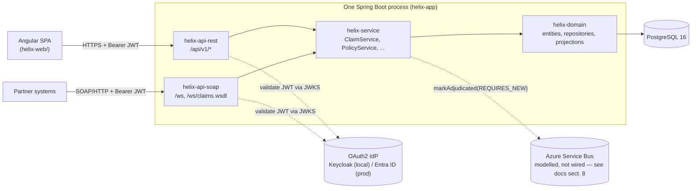

# HELIX


HELIX is an enterprise insurance claims platform: policies, claimants, adjusters, coverage,
claims and their line items, payments, settlements, subrogation and salvage, all backed by a
24-table PostgreSQL schema and served over both a REST API (for an Angular front end) and a
contract-first SOAP API (for partner systems that have not moved off it). It's a Spring Boot 3.3 /
Java 21 backend built to demonstrate how a handful of specific engineering problems — an N+1 query,
concurrent writes to the same row, keeping two protocols honest against one set of business rules —
get found, measured and fixed, not just described.

## Architecture



`helix-api-rest` and `helix-api-soap` both call the same `ClaimService`/`PolicyService` beans —
there is exactly one implementation of "what happens when a claim's status changes." See
[ADR 0001](docs/adr/0001-multi-module-boundaries.md).

## Quick start

Requires Docker. From a clean clone:

```bash
docker compose up --build
```

This starts PostgreSQL 16, Keycloak (with the `helix` realm pre-imported — roles
`ADJUSTER`/`SUPERVISOR`/`READONLY`/`MONITORING` and two demo users), and the app, wired together
with healthchecks so the app doesn't start until its dependencies report healthy. The app runs
with the `local-noauth` profile by default, so every endpoint below is reachable immediately with
no token — see the comment in [`docker-compose.yml`](docker-compose.yml) for how to exercise the
real Keycloak-backed OAuth2 path instead.

| | URL |
|---|---|
| REST API | http://localhost:8080/api/v1/claims |
| Swagger UI | http://localhost:8080/swagger-ui.html |
| OpenAPI document | http://localhost:8080/v3/api-docs |
| SOAP WSDL | http://localhost:8080/ws/claims.wsdl |
| Actuator health | http://localhost:8080/actuator/health/liveness |
| Keycloak admin console | http://localhost:8081 (`admin` / `admin` — throwaway, see `docker-compose.yml`) |

The Angular client (`helix-web/`) is a separate deployable and is not part of this compose stack;
run it on the side with `cd helix-web && npm install && npm start`, which serves it at
`http://localhost:4200` (already in the API's default CORS allow-list — see
`helix-app/src/main/resources/application-local.yml`).

## Endpoints

| Method | Path | Notes |
|---|---|---|
| GET | `/api/v1/claims` | Paged claim summaries — the 2-SQL-statement endpoint, see below |
| GET | `/api/v1/claims/{id}` | Claim detail: lines, documents, policy, claimant, adjuster |
| GET | `/api/v1/claims/{id}/audit` | Audit trail for a claim |
| POST | `/api/v1/claims` | Open a new claim |
| PATCH | `/api/v1/claims/{id}/status` | Change status; requires the version last read, 409 on conflict |
| GET | `/api/v1/policies` | Search policies |
| GET | `/api/v1/policies/{id}` | Policy detail with coverages |
| GET | `/api/v1/claimants/search?q=` | Typeahead, capped server-side at 10 results |
| GET | `/api/v1/adjusters` | Active adjusters with open-claim counts |
| GET | `/api/v1/dashboard/summary` | Dashboard aggregates |
| POST | `/ws` | SOAP: `GetClaim`, `ListClaims`, `GetPolicy` |
| GET | `/ws/claims.wsdl` | WSDL, generated from `claims.xsd` at runtime, publicly readable |
| GET | `/v3/api-docs` | OpenAPI 3 document |
| GET | `/swagger-ui.html` | Swagger UI — unreachable under the `prod` profile |
| GET | `/actuator/health/liveness` / `/readiness` | Kubernetes probes |
| GET | `/actuator/prometheus` | Metrics; requires the `MONITORING` role |

Full authorization matrix in [`SecurityConfig`](helix-app/src/main/java/com/harshaandra/helix/config/SecurityConfig.java)
and [`docs/SECURITY.md`](docs/SECURITY.md).

## Headline engineering results

**The N+1: 244 → 2 SQL statements for one page of 100 claims — a 122× reduction, measured, not
estimated.** [`ClaimFetchStrategyTest`](helix-app/src/test/java/com/harshaandra/helix/ClaimFetchStrategyTest.java)
asks Hibernate's own `Statistics` how many statements it prepared for three fetch strategies on the
same page: lazy associations plus a mapper that reads them (244), an `@EntityGraph` on the three
to-one associations (102 — a real improvement, and still linear, because the `lines` collection
count was still one query per row), and a scalar projection into `ClaimListRow` (2 — flat,
regardless of page size). The test fails the build if any of the three regresses. Full writeup:
[`docs/ARCHITECTURE.md` §2](docs/ARCHITECTURE.md#2-the-n1-found-measured-fixed-and-pinned),
[ADR 0006](docs/adr/0006-projection-over-entity-graph.md).

**Optimistic locking: a real 409, not a lost update.** `Claim.version` (`@Version`) means two
adjusters opening the same claim and both saving ends with the second write rejected —
`StaleClaimException` → HTTP 409 with both version numbers and a `RELOAD_AND_RETRY` hint — rather
than silently overwritten.
[`ConcurrentClaimEditTest`](helix-app/src/test/java/com/harshaandra/helix/ConcurrentClaimEditTest.java)
proves both layers: the service-level version check, and (bypassing that check entirely) that the
database itself rejects the stale write with `ObjectOptimisticLockingFailureException`. See
[ADR 0003](docs/adr/0003-optimistic-locking.md).

**Contract-first SOAP that cannot drift from REST.** [`claims.xsd`](helix-api-soap/src/main/resources/xsd/claims.xsd)
is hand-written and versioned; JAXB classes are generated from it at build time (not committed —
see `.gitignore`) and the WSDL served at `/ws/claims.wsdl` is generated from the same schema at
runtime. `ClaimsEndpoint` (SOAP) and `ClaimController` (REST) call the identical `ClaimService`
bean, so the legacy channel and the modern one cannot give different answers to "what happens when
a claim's status changes." See [ADR 0005](docs/adr/0005-contract-first-soap.md).

## Modules

```
helix-domain     entities, repositories, projections        depends on: nothing but JPA
helix-service    business rules, transaction boundaries     depends on: domain
helix-api-rest   @RestController, OpenAPI, RFC 7807          depends on: service
helix-api-soap   contract-first JAX-WS endpoints             depends on: service
helix-app        bootstrap, security, Flyway migrations      depends on: both API modules
```

Why five modules, and exactly what that boundary does and does not guarantee (Maven has no
Gradle-style `api`/`implementation` split): [ADR 0001](docs/adr/0001-multi-module-boundaries.md).

## Tests

```bash
mvn verify              # 36 unit tests — no Docker required
mvn -Pintegration test   # integration tests — Testcontainers, a real PostgreSQL
```

Integration tests never run against H2 — `docs/ARCHITECTURE.md` §6 explains why (H2's Postgres
compatibility mode doesn't reproduce the planner, locking or type coercion the optimistic-locking
and N+1 tests actually depend on). CI (`.github/workflows/ci.yml`) runs both groups as separate
jobs.

## Deployment

`Dockerfile` (multi-stage, non-root, JVM sized for its cgroup limit) · `docker-compose.yml` (local
stack) · `helm/` (liveness/readiness/startup probes, Azure Workload Identity + Key Vault CSI —
zero secrets in any manifest, default-deny `NetworkPolicy`) · `infra/` (Terraform: AKS, Key Vault,
Postgres Flexible Server, Service Bus) · dual CI/CD in `.github/workflows/` (GitHub Actions) and
`azure-pipelines.yml` (Azure DevOps, blue/green rollout with a documented rollback step) — both run
the same gates: unit tests, integration tests, OWASP Dependency-Check (fails ≥ CVSS 7), a Docker
build scanned with Trivy (fails on HIGH/CRITICAL), and `helm lint`.

## Further reading

- [`docs/ARCHITECTURE.md`](docs/ARCHITECTURE.md) — the reasoning behind every decision below, in one place
- [`docs/SECURITY.md`](docs/SECURITY.md) — OWASP Top 10 mapping, CSRF/XSS posture, secrets handling
- Architecture Decision Records: [0001](docs/adr/0001-multi-module-boundaries.md) module boundaries ·
  [0002](docs/adr/0002-transactional-boundaries.md) transaction boundaries & the proxy self-invocation trap ·
  [0003](docs/adr/0003-optimistic-locking.md) optimistic locking ·
  [0004](docs/adr/0004-flyway-expand-contract.md) Flyway expand/contract ·
  [0005](docs/adr/0005-contract-first-soap.md) contract-first SOAP ·
  [0006](docs/adr/0006-projection-over-entity-graph.md) the N+1 investigation
- [`load-test/`](load-test/README.md) — a k6 script for producing your own latency/error-rate numbers under load

## What's deliberately not built

(`docs/ARCHITECTURE.md` §8, in full, because a reviewer will find these anyway:)

- **Claim numbers come from `ThreadLocalRandom`.** Readable and unique enough for a demo; two
  application instances could collide. Production wants a database sequence.
- **Documents are metadata only.** `claim_document` stores an object-store key; no upload path is
  implemented. Binary content in Postgres would be the wrong call, so the column is the contract
  and the storage integration is not built.
- **The async adjudication path is modelled but not wired to Azure Service Bus** in the local
  compose stack — `markAdjudicated` exists with `REQUIRES_NEW` propagation and is called by tests,
  not by a live subscription. (`infra/servicebus.tf` provisions the namespace/topic/subscription a
  real listener would bind to.)
- **`activeClaims` on the adjuster DTO is computed per adjuster.** Fine for a five-person team, an
  N+1 of its own for a five-hundred-person one. It would become a single grouped query.
- **No penetration test has been performed** and rate limiting is not implemented in the
  application (it belongs at the ingress) — see `docs/SECURITY.md`, "What is deliberately not
  claimed."
